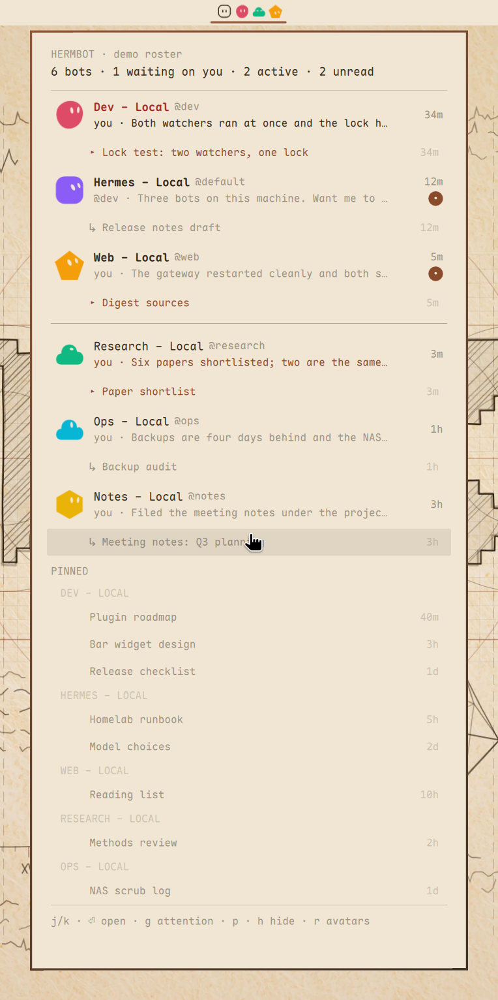
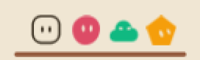

# Hermbot

Your **Hermes Bot Mode roster in the Omarchy bar**: every bot as its own avatar,
the newest thing it said, and one click to it.



A bot is a Hermes profile. There is no second source of truth here: the widget
reads the same files the desktop writes (`profile.yaml`'s `ui_meta['hermes-bots']`
for the avatar, each profile's session store for the canonical **Bot Chat**), so
a bot created, renamed or recoloured in Hermes Desktop shows up in the bar
without any configuration on this side.

The bar entry, on its own:



Built and running on a live install: bar avatars in each bot's own shape and
colour, the "waiting on you" count that survives a restart, notification cards on
a bot write, and a click that opens (or switches to) that bot. The drawing engine
is Rakabot's, adapted - see `NOTICE` for the lineage.

## What it does

| | today |
|---|---|
| Roster in the bar: avatar per bot, "waiting on you" count | yes |
| Panel: sections, newest preview, relative time, activity | yes |
| Under each bot: the session it is in, else the last one it finished | yes, and clicking it opens that session |
| Pinned chats, grouped by the bot they belong to | yes (`p` hides the section, the choice is saved) |
| Desktop notification when a bot writes, click opens that bot | yes |
| Send a message into a bot's canonical Bot Chat | via `bin/hermbot-send` (the panel has no input, as in Rakabot) |
| Open Hermes on the bot's most recent conversation | yes |
| Open Hermes directly on the bot's **canonical Bot Chat** | waiting on upstream: PR [#115195](https://github.com/NousResearch/hermes-agent/pull/115195) adds `hermes://bot/<profile>`, verified live from this widget's side - until it ships, a click opens the bot's most recently active visible session |

## Requirements

- Omarchy (Quattro) with the bar, `omarchy-notification-send` on `PATH`
- A local Hermes install (`~/.hermes`), gateway or desktop backend running
- `python3` (standard library only - no pip installs, no venv)

## The three binaries

All reads are read-only, from the local install; nothing is written to a profile
and nothing is sent off the machine. There is no token to configure - unlike a
hosted chat service, the Hermes roster is already on disk.

### `bin/hermbot-watch`

Follows the install and streams the roster as JSON lines.

```bash
hermbot-watch --once --pretty      # one snapshot, human readable
hermbot-watch --interval 2        # stream (what the widget runs)
hermbot-watch --interval 2 --notify   # ... and raise cards on bot writes
hermbot-watch --mark-seen dev     # record that dev was opened (hermbot-open calls this)
```

`--once` is a read-only query: it never writes the `seen` watermark. The
streaming watcher does seed bots it has no record for (at their own last turn),
so a fresh install announces nothing.

The snapshot is the widget's whole data source:

```json
{
 "counts": {"bots": 3, "waiting": 0, "active": 1, "no_chat": 0},
 "gateway": {"pid": 3748184, "running": true, "profiles": ["default", "dev", "web"]},
 "bots": [{
  "name": "dev", "handle": "@dev", "title": "Dev - Local",
  "shape": "blobatar::round", "color": "#dd4b66",
  "chat": {"session_id": "20260905_131013_938fbf", "exists": true, "hidden": true,
       "unread": false, "message_count": 200, "preview": "...",
       "preview_role": "assistant", "from_bot": null},
  "recent_session": {"session_id": "20260918_145557_e98322", "title": "..."},
  "active": true, "waiting": false,
  "open": {"deep_link": "hermes://open/<bot-chat>?profile=dev",
       "recent_deep_link": "hermes://open/<recent>?profile=dev"}
 }]
}
```

Definitions are taken from the desktop's own code, not invented:

- **waiting on you** = the backend watermark, OR the one this widget keeps
  itself. The backend half: `last_read_at` NULL means *read*, `0` means
  *unread*, otherwise unread when activity postdates it
  (`SessionDB.session_unread`); verified A/B against that function, identical on
  all six watermark cases, both edge values included. The widget's half: the
  bot's own newest turn is newer than the last time that bot was opened from the
  bar (`~/.local/state/omarchy/hermbot/seen.json`, stamped by `hermbot-open`).
  It exists because the desktop never writes its watermark while you merely
  read, so on the backend rule alone the roster would sit still forever - and
  the avatars only animate on state changes. A bot with no record is seeded at
  its own last turn, so a fresh install announces nothing.
- **active** = a message in any of the bot's sessions within 90 s (the roster's
  own activity window).
- **the session under a bot** = the one it is still in (`ended_at` is NULL), and
  when it is in none, the last one it finished - newest by activity either way,
  because several sessions can be left open at once. Hidden sessions are skipped:
  the row exists to be opened, and a canonical Bot Chat is not openable. The
  marker says which of the two you are looking at, and the accent colour means
  the bot is in it right now.
- **pinned** = `pinned = 1` on a visible session, listed in its own section under
  the bot it belongs to - the desktop's own Pinned, and never a second copy of a
  row that is already in the list.
- **row order** = newest of (bot created, newest message in any of its sessions).
- **canonical chat** = the session titled exactly `Bot Chat` - always hidden, and
 the only door to a bot's forever-conversation.

Notifications only fire on **transitions**, only when the **bot** wrote (being
told about a message you just sent is noise), at most one card per bot (replace
id), and the first run records the world instead of describing it. State lives
outside the plugin directory (`~/.local/state/omarchy/hermbot/`) under
`flock`, because a bar widget is often instantiated twice and both copies run a
watcher. Failures are logged to `notify.log`, never swallowed.

### `bin/hermbot-open`

Raises Hermes on a bot.

```bash
hermbot-open --bot dev [--focus] [--print]
```

Ladder, in order: launch the packaged Electron binary with
`hermes://open/<session>?profile=<bot>` as argv (the running app picks it up
through its single-instance handler; a cold app boots on it) -> `xdg-open` the
link -> raise the window only. `--focus` also raises the window through Hyprland
(note: this Hyprland is Lua-configured, so the dispatcher must be called as Lua).

### `bin/hermbot-send`

Says something to a bot, into its canonical Bot Chat - the same conversation the
desktop, the CLI and the bot-to-bot `message_agent` tool use.

```bash
hermbot-send --bot dev "status?"    # detached: the reply arrives as a card
echo "long text" | hermbot-send --bot web
hermbot-send --bot dev --wait "ping"  # foreground, prints the reply
```

The delivery door is the one Hermes itself uses for bot-to-bot DMs:
`hermes -p <bot> chat --in ~ -c "Bot Chat" --create-if-missing -Q --query-file <file>`,
so nothing is shell-interpreted and the canonical chat is created on demand by
Hermes, never forked by this widget. The message file must outlive the spawn (a
detached turn reads it after the launcher exits), so it lives under the state
dir at `0600` and is pruned by the next run.

## The upstream gap: opening a bot's own chat

`hermes://open/<session-id>?profile=<bot>` is delivered by Hermes Desktop and
switches the window for a **visible** session - verified live, both directions.
It does **not** work for a canonical Bot Chat: those sessions are born hidden, and
the desktop's route validation only accepts a session id that is in its loaded
(visible) list, so the navigation is dropped silently. The Bots roster is a
plugin *pane*, not a route, so it has no address either.

Until the app grows a door for bot chats (`hermes://bot/<name>`, or a
`?bot=<name>` on a roster route), this widget opens the bot's most recently
active ordinary conversation - exactly what the roster's own right-click does - 
and `--chat` is already implemented and correct for the day the door exists.

## Roadmap

1. Flip the click to the **canonical Bot Chat** the day `hermes://bot/<profile>`
   ships in a released desktop (`HERMBOT_DESKTOP_BIN` already lets the door be
   tested against a build from a branch).
2. Unread as a count rather than a marker, once the store exposes one - Hermes
   reports `unread` as a boolean today.
3. Marketplace submission.

## Development

The plugin folder is a git checkout, so the dev loop is commit-first:

```bash
git commit -am "..." && omarchy plugin update <id> --yes && omarchy restart shell
```

Plugins are installed from committed content only; uncommitted QML installs as a
broken widget with no error.

## License

Apache-2.0. `Widget.qml` and `Avatar.qml` are derived from **Rakabot** (my own
plugin for Rakazo, Apache-2.0), which is itself a QML derivative of
[njpatel/omabot](https://github.com/njpatel/omabot) - the visual design, the
avatar rendering and the bar/panel layout come from that lineage. `NOTICE` names
both, and each derived file carries a notice of modification at the top. The
data layer, the actions and the documentation are new here.
